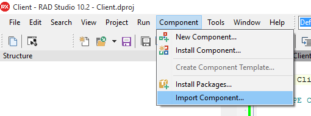
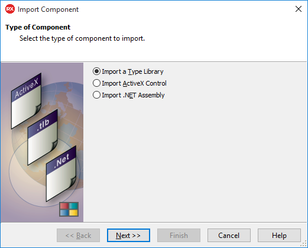
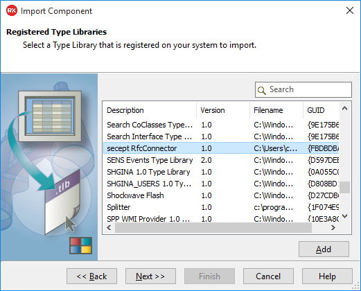
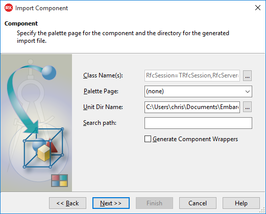
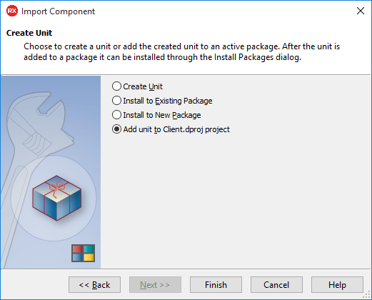

# RFC Connector: Delphi Example (Client and TableReader)

This example demonstrates how to connect SAP with Delphi using [RfcConnector](http://rfcconnector.com/). 
It shows how to call Function Modules (BAPIs) and how to read table data from an SAP server/backend.

## Importing the Type Library
To be able to access the Rfc Connector components in Delphi, you need to import the 
Type Library first.

To import the Type Library, select "Component"->"Import Component" from the menu. 



Then, in the wizard, select "Import a Type Library" in the first screen



Press "Next", then select "secept Rfc Connector" from the list:



Skip the third screen by pressing "Next"



Then select "Add unit to projectname" in the last screen.



After the wizard is complete, Delphi will create a unit which contains the necessary components for Rfc Connector.

## Connecting to the SAP system

Rfc Connector supports three session classes:

* NWRfcSession (recommended with SAP GUI 7.50+)
* RfcSession (legacy, use only if you cannot upgrade)
* SoapSession (http(s) connection, use if you don't want to install additional libraries. Does not support SSO and Visual RFC.)

To create a session, just create the COM instance:

```delphi
// create an NWRFC session instance
session:= CreateComObject(CLASS_NWRfcSession) as IRfcSession;
```

After creating the session instance, add the destination and the credentials:

```delphi
// configure the connection (using connection data from SAPLogon entry)
session.RfcSystemData.ConnectString := 'SAPLOGON_ID=xyz';

// fill in credentials
session.LogonData.Client := '001';
session.LogonData.User := 'DEVELOPER';
session.LogonData.Password := '***';
session.LogonData.Language := 'EN';
```

Finally, connect to the system:

```delphi
// connect to the SAP system
session.Connect();
```

## Calling a function module/BAPI

To call a function module or BAPI, import the function prototype, set the parameters, 
then call it and process the result:

```delphi
// import the function call definition
fn := session.ImportCall('BAPI_FLIGHT_GETLIST', True);

// set IMPORTING parameter (=sent to SAP)
fn.Importing['AIRLINE'].value := 'LH';

// call the function
session.CallFunction(fn, True);

// read out the data returned from the SAP system
for I := 1 to fn.Tables['FLIGHT_LIST'].Rows.Count do begin
   row := fn.Tables['FLIGHT_LIST'].Rows[I];
   writeln(string(row['AIRLINEID'].value) + ' ' + string(row['FLIGHTDATE'].value));
end;
```

## Reading database tables

To read data from a database table, just create an instance of `TableReader`, call `read()`
and process the result:

```delphi
// create `TableReader` instance
TableReader tr = session.GetTableReader("SFLIGHT");

// set up query parameters
tr.Query.Add("CARRID EQ 'LH'");

// read rows
tr.Read(0, 0);

// process the result
  for I := 1 to tr.Rows.Count do begin
    row := tr.Rows[I];
    writeln(string(row['FLDATE'].value) + ' ' + string(row['PRICE'].value));
  end;
```

Note: For limitations of this approach and possible workarounds, 
please refer to the [knowledgebase entry](http://rfcconnector.com/documentation/kb/0007/)
